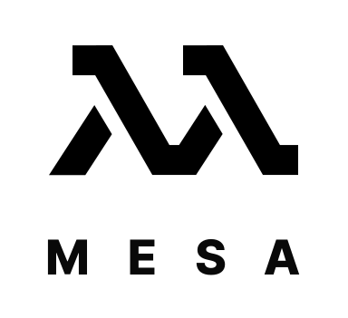

 
 

Mesa is a functional programming library for Javascript that I began while doing Advent of Code 2021. This is now a library I'll mangle and use to learn FP. (Mesa is taken from Black Mesa, the name of the science facility that served as the background for the video game Half Life)
